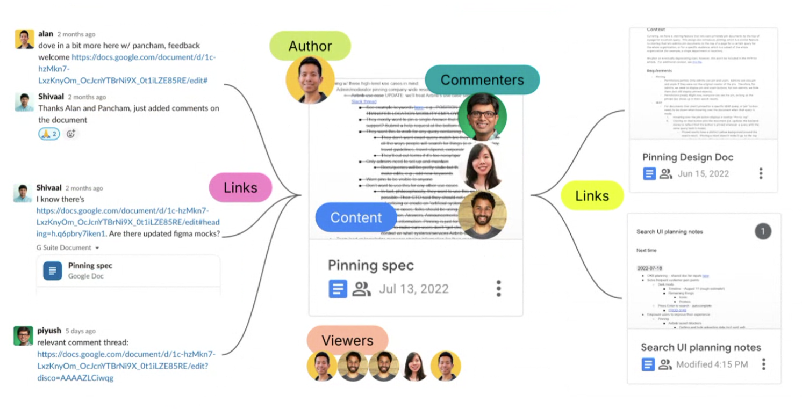

Wasn't sure how to start, so I asked Glean for a joke to break the ice.

> *Why don't skeletons fight each other? They don't have the guts.*

There ya go, what a great ice breaker! That punch line should read "No [AI] guts, no [AI] glory". Since starting at Glean I have had to re-think the way I find information. More specifically finding content that makes sense. I think all of us typically start our hunt by searching Slack, email, Google Drive, local machine, OneDrive, Box, Salesforce, Jira, Confluence and the list goes on. I might find the content, but had to ask myself is it relevant? Then open, read, check last updated date, and in most cases move on to the next piece of content to do the same thing, rinse and repeat, move on to the next.

What if I could find the content needle in the haystack? Find that single kickass slide Joe presented, Ryan's notes from a Salesforce opportunity, Ann's Jira issue related to my project, code to get started as a new developer, a Slack discussion about a customer, email about travel plans, and the list goes on.

What excites me about Glean started with my own education. I needed to learn the interworkings of LLMs, models, analysis to understand how it all worked. So, I enrolled in an AI/ML post-grad program. I learned the core concepts, how to build and tune models and perform data analysis using Python (more on that in future posts). It felt like I put a new set of glasses on that opened my eyes to a different way of thinking and appreciation of the tech.

Joining Glean is my personal game changer. I'm now part of a company focused on innovation and how you use AI at work to be better. Regardless of what or how we produce content, we are improving the world corpus that continuously improves learning that helps us at work and personally.

Time to make it happen, make it better and do it together.

Lots more to come.

Cheers -- Rob
